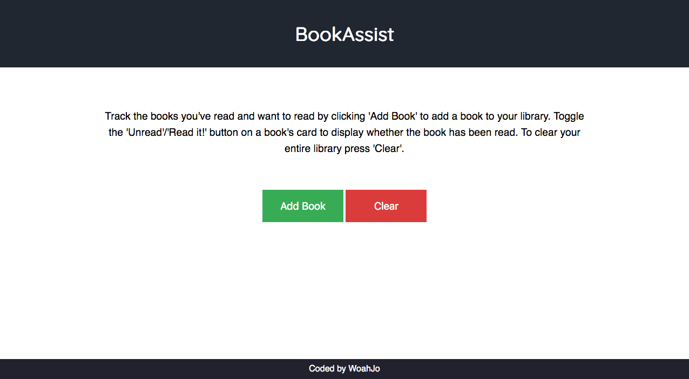
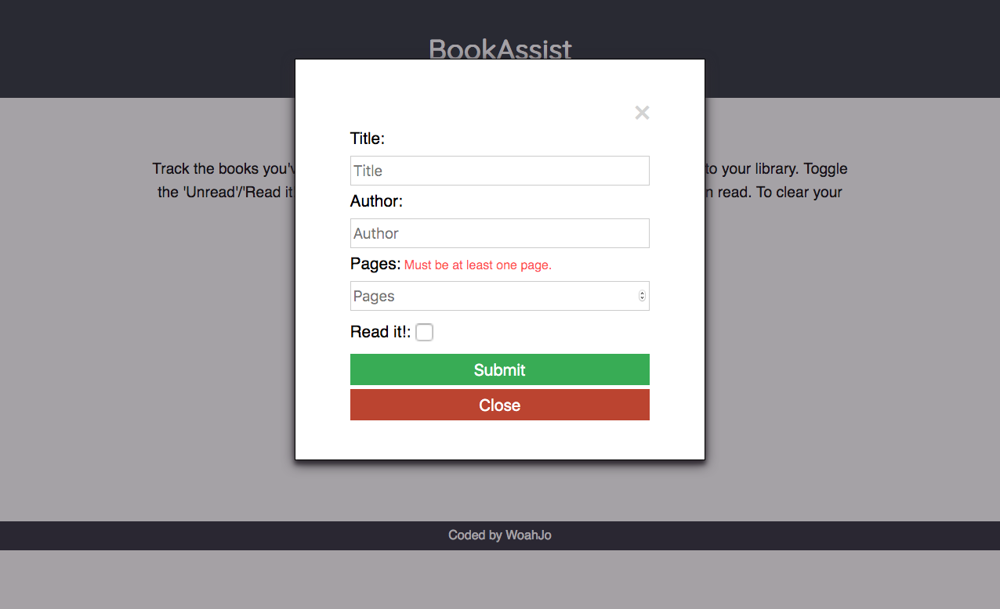
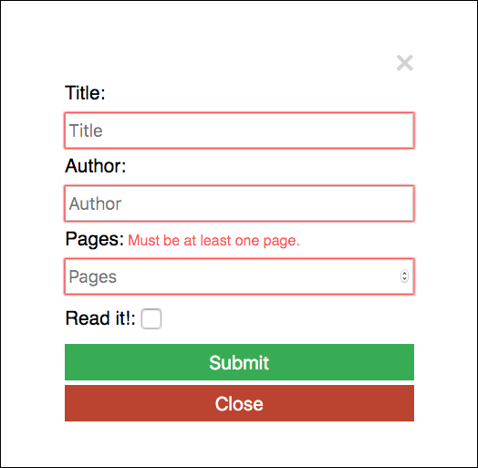
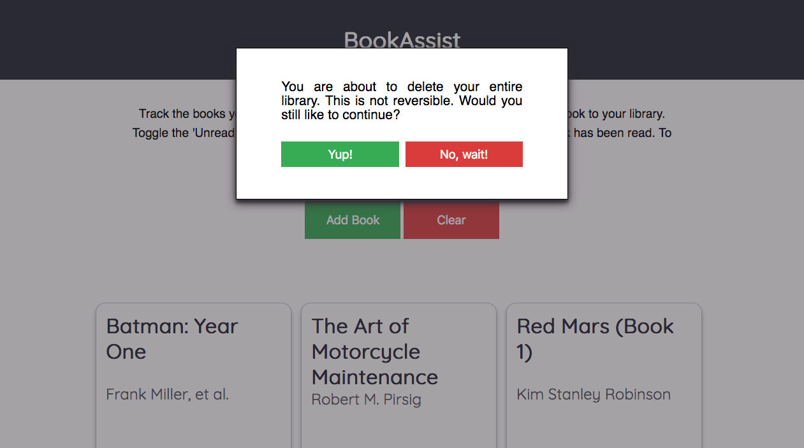

# BookAssist  
  
BookAssist is a library web-app that allows you to keep up with books that you have read or would like to read. The app utilizes localStorage which saves added books locally.  
  
## Features:  
  
  
  
This web app features an **Add Book** button, which allows you to add a book to your library, and a **Clear** button, which removes all added books from the page as well as your local storage.  
  
  
  
The **Add Book** button pulls down a form that allows you to provide the title, author, amount of pages and whether you have read the book yet. When you're done, the form does not disappear in case you would like to add more than one book. Once you are done, you can either use the **Close** button at the bottom or the &times; in the top-right corner.  
  
  
  
If the required input is not provided, the form will not submit until you correct the invalid field(s).  
   
  

As you enter books and press **Submit** on the form, the field below the **Add Book** and **Clear** buttons will fill with your entries. Each card features a **Read it!/Unread** and  **Remove** button. Let's say that you actually didn't read that one book you thought you did, you can toggle the **Read it!/Unread** button by clicking on it to change the read status on the book.  
  
  
  
When you decide that you'd like to empty your entire library and start fresh, you can do so by clicking the **Clear** button at the top of the page, which will pull down an alert telling you that the action is irreversible and asking you to confirm your choice. If you choose to continue, the page will clear and your library will be wiped from your local storage. 